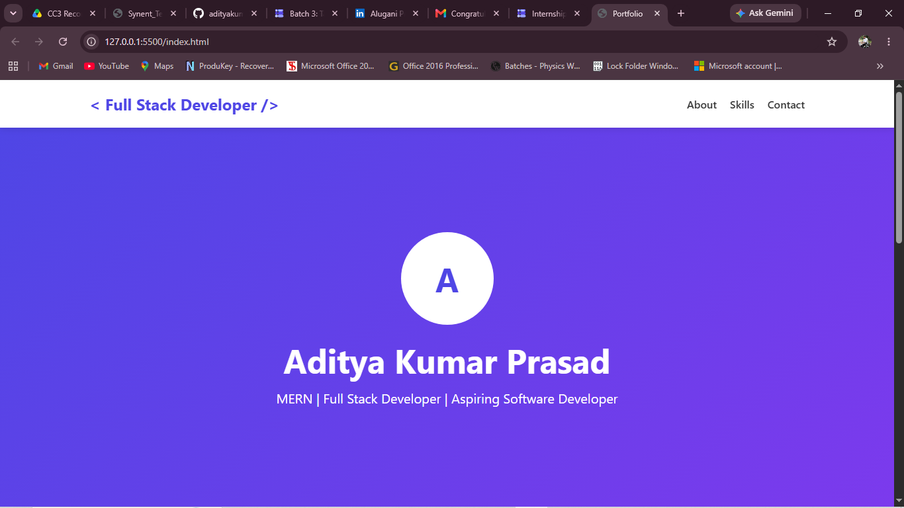
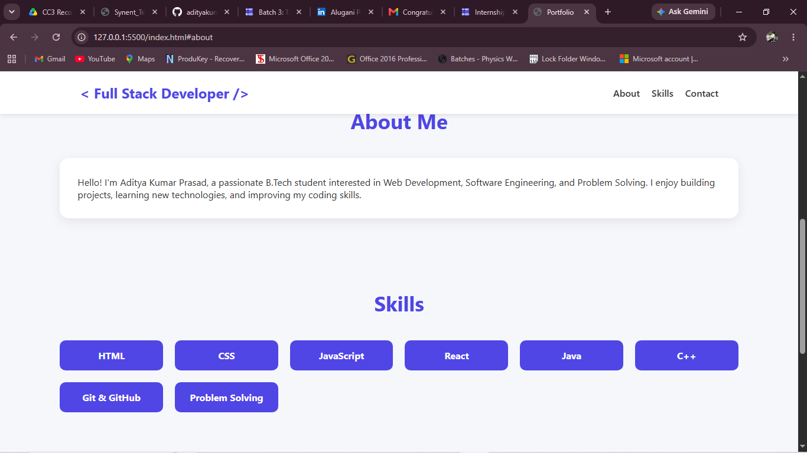
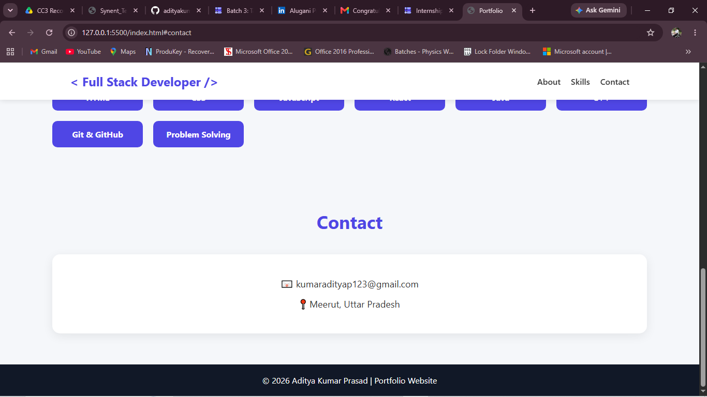

# Personal Portfolio Website

## Project Title

Personal Portfolio Website using HTML and CSS
<br/>

## Objective

The objective of this project is to create a responsive and visually appealing personal portfolio website using HTML and CSS. The website serves as an online platform to showcase personal information, technical skills, and contact details in a professional manner.

This project demonstrates the fundamentals of front-end web development, including webpage structure, styling, responsive design, and user interface development.

## Problem Statement

Design and develop a single-page personal portfolio website containing the following sections:

- Header (Name & Title)
- About Me
- Skills
- Contact Information

The website should have:

- Clean layout
- Proper spacing and alignment
- Professional appearance
- Responsive design for different screen sizes

<br/>

## Technologies Used

### HTML

HTML (HyperText Markup Language) is used to create the structure of the website.

HTML elements used:

- `<html>`
- `<head>`
- `<body>`
- `<nav>`
- `<section>`
- `<h1>`, `<h2>`
- `<p>`
- `<div>`
- `<footer>`
- `<a>`

### CSS

CSS (Cascading Style Sheets) is used to style and enhance the appearance of the website.

CSS concepts used:

- Flexbox
- Grid Layout
- Responsive Design
- Media Queries
- Hover Effects
- Shadows
- Gradient Backgrounds
- Border Radius
- Typography Styling

<br/>

## Project Structure

```
Personal-Portfolio-Website/
│
├── index.html
├── style.css
├── README.md
├── screenshots/
│   ├── home.png
│   ├── about.png
│   └── contact.png
```

## Methodology

The development process was divided into several phases:

### Phase 1: Planning

The required sections were identified:

1. Navigation Bar
2. Hero Section
3. About Section
4. Skills Section
5. Contact Section
6. Footer

A clean single-page layout was chosen for simplicity and ease of navigation.

### Phase 2: HTML Structure Development

The website structure was created using semantic HTML elements.

Examples:
```
<nav></nav> 
<section id="about"></section> 
<section id="skills"></section> 
<section id="contact"></section> 
<footer></footer>
```

Semantic tags improve readability, maintainability, and accessibility

### Phase 3: Styling with CSS

CSS was used to create a modern user interface.

**Features Implemented**

- Gradient hero background
- Sticky navigation bar
- Card-based layout
- Responsive grid system
- Hover animations
- Mobile responsiveness

### Phase 4: Responsive Design

Media queries were implemented to ensure proper display on:

- Desktop computers
- Laptops
- Tablets
- Mobile devices


Example:

```
@media(max-width:768px) 
{ 
    nav{ 
        flex-direction:column; 
    } 
}
```

## Website Components

## 1. Navigation Bar

### Purpose

Provides easy navigation between sections.

### Features

- Portfolio logo
- About link
- Skills link
- Contact link
- Sticky positioning

### Benefits

- Better user experience
- Quick access to content

<br/>

## 2. Hero Section

### Purpose
Introduces the portfolio owner.

### Contents
- Profile avatar
- Name
- Professional title

### Design Features
- Purple gradient background
- Center alignment
- Large typography

<br/>

## 3. About Me Section

### Purpose
Provides a brief introduction.

### Information Included
- Educational background
- Career interests
- Technical aspirations

### Design Features
- Card layout
- Shadoe effect
- Rounded corners

<br/>

## 4. Skills Section
### Purpose
Displays technical skills and competencies.

### Design Features
- CSS Grid Layout
- Responsive design
- Skill badges

<br/>

## 5. Contact Section
### Purpose
Allows visitors to connect with the portfolio owner.

### Information Included
- Email Address
- Location

### Design Features
- Centered card
- Professional presentation

<br/>

## 6. Footer
### Purpose
Displays copyright information.

Example

© 2026 Aditya Kumar | Portfolio Website

<br/>

## CSS Techniques Used

### Flexbox

Used in the navigation bar.
```
display:flex;
justify-content:space-between;
align-items:center;
```

### Advantages
- Easy alignment
- Responsive layouts
- Better spacing control

<br/>

### CSS Grid
Used in the skills section.
```
display:grid;
grid-template-columns:
repeat(auto-fit,minmax(150px,1fr));
```

### Advantages
- Responsiv skill layout
- Automatic adjustment
- Clean presentation

### Hover Effects
```
.card:hover{ 
    transform:translateY(-5px); 
}
```

### Benefits
- Improves interactivity
- Enhances user experience

### Box Shadow
```
box-shadow: 
0 5px 20px rgba(0,0,0,0.08);
```

### Purpose
Adds depth and modern appearance to cards.

### Gradient Background
```
background: 
linear-gradient( 135deg, #4f46e5, #7c3aed );
```

### Purpose 
Creates an attractive hero section.

<br/>

## Features of the Website
- Single-page layout
- Responsive design
- Modern UI
- Smooth navigation
- Clean typography
- Card-based sections
- Hover animations
- Professional appearance

<br/>

## Output
The final output is a responsive portfolio website that successfully displays:

- Personal information
- Professional title
- Technical skills
- Contact details

The website works effectively on both desktop and mobile devices while maintaining a clean and modern user interface.

<br/>

## Screenshots

### Home Page




### About Section


### Contact Section


<br/>

## Advantages
- Easy to navigate
- Professional presentation
- Responsive on all devices
- Lightweight and fast loading
- Beginner-friendly implementation
- Easily customizable

<br/>

## Conclusion
This project successfully demonstrates the creation of a professional personal portfolio website using HTML and CSS. The website follows modern web design principles and provides a responsive, user-friendly interface for showcasing personal and professional information. The project helped strengthen front-end development skills and provided practical experience in building real-world web applications.